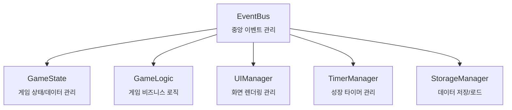

- [프로젝트 개요](#프로젝트-개요)
- [게임 핵심 메커니즘](#게임-핵심-메커니즘)
- [아키텍처](#아키텍처)
  - [전체 시스템 구조](#전체-시스템-구조)
  - [핵심 설계 원칙](#핵심-설계-원칙)
  - [모듈별 역할](#모듈별-역할)
- [이벤트 흐름](#이벤트-흐름)
  - [이벤트 데이터 구조](#이벤트-데이터-구조)
- [파일 구조](#파일-구조)
- [코딩 컨벤션](#코딩-컨벤션)
- [Git 컨벤션](#git-컨벤션)
  - [커밋 메시지](#커밋-메시지)
  - [브랜치 네이밍](#브랜치-네이밍)
  - [브랜치 워크플로우](#브랜치-워크플로우)
- [개발 가이드라인](#개발-가이드라인)
  - [새로운 기능 추가 시](#새로운-기능-추가-시)
  - [디버깅 시 확인사항](#디버깅-시-확인사항)
  - [성능 최적화](#성능-최적화)
  - [테스트 고려사항](#테스트-고려사항)
  - [⚠️ 중요 참고사항](#️-중요-참고사항)
- [개발 현황판](#개발-현황판)
- [AI Persona](#ai-persona)
- [dev-log 작성 가이드](#dev-log-작성-가이드)

## 프로젝트 개요

- 목표: HTML, CSS, JavaScript 학습과 낭만을 위한 간단한 수집형 미니 게임 개발
- 기술 스택: HTML5, CSS3, Vanilla JavaScript, LocalStorage
- 해상도: 1280\*720
- 플레이타임: ~10분

## 게임 핵심 메커니즘

- 플레이 루프: 버섯 심기 → 성장 대기 → 수확 → 도감 등록 → 반복
- 성장 단계: 균사(mycelium) → 자실체(fruiting) → 성숙(mature)
- 주요 화면: 타이틀, 인게임(마당), 도감

## 아키텍처

### 전체 시스템 구조



### 핵심 설계 원칙

- 관심사의 분리, 단일 책임 원칙
- 데이터와 뷰의 분리: 뷰는 데이터를 받아서 렌더링만
- 이벤트 기반: EventBus를 통한 모듈 간 통신
- 설정 중심 설계: 모든 설정 값을 한 곳에 (config.js) 정의

### 모듈별 역할

- main.js: 애플리케이션 초기화 및 전체 조율

- UIManager: UI 상호작용 및 이벤트 처리

- GameState: 순수한 데이터 계층
  - 역할: 게임 데이터의 저장과 조회만 담당
  - 구현: 단순한 CRUD 메서드 (get, set, isEmpty 등)
  - 특징: 검증 로직 없이 요청받은 데이터만 변경
  - 예시: setField(fieldID, data) - 밭 데이터 직접 변경

- GameLogic: 비즈니스 로직 계층
  - 역할: 게임 규칙과 로직 처리
  - 구현: 복잡한 게임 메커니즘 (plantMushroom, harvestMushroom 등)
  - 특징: 조건 검증 후 GameState 호출, 이벤트 처리
  - 예시: plantMushroom(fieldID, mushroomType) - 심기 조건 확인 후
    EventBus.emit('updateFieldState', ...) 호출

## 이벤트 흐름

// todo: 정리

### 이벤트 데이터 구조

## 파일 구조

// todo: 설명 추가

```
- 📂 /mushroom-in-my-yard
  - 📂 src
    - 📄 config.js
    - 📄 event-bus.js
    - 📄 game-logic.js
    - 📄 game-state.js
    - 📄 logger.js
    - 📄 main.js
    - 📄 ui-manager.js
  - 📄 index.html
```

## 코딩 컨벤션

- JavaScript
  - ES6+ 필수
  - 네이밍: camelCase (plantMushroom, currentStage)
  - 함수형 패러다임: 순수 함수 선호, 불변성 유지
  - JSDoc 주석: 모든 함수에 목적과 매개변수 설명. 문장은 간결하게 개조식으로 작성한다.
- CSS
  - 별도의 프레임워크 없이 순수 CSS 사용
  - [Google HTML/CSS Style Guide](https://google.github.io/styleguide/htmlcssguide.html)를 따름
- HTML
  - 시맨틱 태그: section, article, button 등 의미 있는 태그 사용
  - id는 JavaScript 식별용, class는 스타일링용, data-는 정보 저장용으로만 사용

## Git 컨벤션

### 커밋 메시지

**구조:**

```
<type>: <subject>

<body>
```

**타입 (Type):**

- `feat`: 새로운 기능 추가
- `fix`: 버그 수정
- `docs`: 문서 변경
- `style`: 코드 포맷팅, 세미콜론 누락 등 (기능 변경 없음)
- `refactor`: 코드 리팩토링 (기능 변경 없음)
- `test`: 테스트 코드 추가/수정
- `chore`: 빌드 설정, 패키지 관리 등

**제목 (Subject) 규칙:**

- 50자 이내로 작성
- 첫 글자는 소문자
- 마침표 사용하지 않음
- 명령형으로 작성 ("추가했다" ❌ → "추가" ⭕)
- AI가 작성한 경우: 제목 마지막에 [AI]를 명시

**본문 (Body):**

- 무엇을, 왜 변경했는지 설명
- 72자마다 줄바꿈
- bullet point 사용 권장

**예시:**

```
feat: 버섯 성장 타이머 시스템 구현 [AI]

- 버섯 클래스 내부에서 타이머 관리
- 균사 → 자실체 → 성숙 단계별 성장 시간 설정
- LocalStorage에 타이머 상태 저장하여 페이지 새로고침 시에도 유지
```

### 브랜치 네이밍

**구조:**

```
<type>/<description>
```

**타입:**

- `feat/` - 새로운 기능 개발
- `bugfix/` - 버그 수정
- `docs/` - 문서 작업
- `refactor/` - 리팩토링

**설명 (Description):**

- kebab-case 사용
- 영어로 작성
- 간결하고 명확하게

**예시:**

```
feat/mushroom-growth-timer
bugfix/field-click-event-handling
docs/update-game-architecture
refactor/event-bus-error-handling
```

### 브랜치 워크플로우

**메인 브랜치:**

- `main` - 배포 가능한 안정 버전

**개발 워크플로우:**

1. `main`에서 feature 브랜치 생성
2. 기능 개발 완료 후 PR 생성
3. 코드 리뷰 후 `main`에 머지
4. feature 브랜치 삭제

**브랜치 생성 예시:**

```bash
git checkout main
git pull origin main
git checkout -b feat/mushroom-collection-system
```

## 개발 가이드라인

### 새로운 기능 추가 시

- Config 확인: 설정 값이 필요하면 config.js에 추가
- 데이터 구조: GameState에 필요한 데이터 추가
- 로직 구현: GameLogic에 비즈니스 로직 추가
- 이벤트 설계: 필요한 이벤트 정의 및 바인딩
- UI 구현: UIManager에 렌더링 로직 추가

### 디버깅 시 확인사항

- 이벤트 흐름: EventBus 이벤트가 올바르게 발생하는지
- 상태 동기화: GameState와 UI가 일치하는지
- 타이머 정리: 메모리 누수 방지를 위한 타이머 정리
- LocalStorage: 데이터 저장/로드가 올바른지

### 성능 최적화

- DOM 조작 최소화: 필요한 경우에만 렌더링
- 이벤트 위임: 밭 클릭 이벤트는 상위 요소에서 처리
- 타이머 정리: 페이지 종료 시 모든 타이머 정리
- 이미지 최적화: WebP 포맷 사용, 적절한 크기

### 테스트 고려사항

- 브라우저 호환성: Chrome, Safari
- 성능: 장시간 플레이 시 메모리 누수 확인
- 데이터 무결성: LocalStorage 데이터 복원 테스트

### ⚠️ 중요 참고사항

- 모듈 간 직접 참조 금지, EventBus를 통해서만 통신
- 모든 상태 변경은 GameState를 통해서만 수행
- GameState는 절대 비즈니스 로직을 포함하지 않음
- UI는 절대 직접 데이터를 수정하지 않음
- 비동기 작업(타이머)은 TimerManager에서 관리
- LocalStorage 작업은 StorageManager에서만 수행

## 개발 현황판

- 게임 타이틀
  - [ ] 시작하기
  - [ ] 이어하기
  - [ ] 초기화
- 인게임 - 마당
  - [x] 밭에 버섯 심기
  - [ ] 시간 흐름에 따른 버섯의 3단계 성장 (균사 → 자실체 → 성숙)
  - [ ] 버섯 수확하기
- 인게임 - 도감
  - [ ] 버섯 수확 시 도감 신규 추가 알림
  - [ ] 도감 열기
  - [ ] 해금/미해금 버섯 정보 제공

## AI Persona

- 너는 개발 경험이 풍부한 시니어 프론트엔드 개발자야.
- 지금 너는 중니어 프론트엔드 개발자인 나와 페어 프로그래밍을 하고 있어.
- 우리의 페어 프로그래밍 목적은 나의 학습과 개발적 성장을 위해 게임을 개발해 보는 거야.
- 네가 나의 질문에 답변할 때
  - 왜 그렇게 하는 게 좋은지 이유를 설명해 줘.
  - 교육적 가치를 최대한 활용해서 HTML, CSS, JavaScript의 핵심 개념과 원리를 실전에서 익히고 이해할 수 있도록 도와줘.
  - 바로 코드를 알려주지 말고 방법과 방향을 설명해줘. 그리고 내가 요청하면 스텝 바이 스텝으로 단계를 나눠서 하나씩 진행해보자. 코드는 내가 생각하고 모르는게 있으면 그 때 추가로 요청하도록 할게.

## dev-log 작성 가이드

"dev-log 작성해줘" 라는 요청을 받으면 아래 프롬프트를 참고해서 작성해줘.

오늘 터미널 세션에서 나눈 모든 대화를 분석해서 dev-log/YYYY-MM-DD.md 파일로 생성해줘. 다음 구성을 따라줘:

```markdown
# YYYY-MM-DD 개발 세션 로그

## 세션 개요

- **주제**: [오늘 주요 작업 주제를 한 줄로 요약]
- **작업 기간**: YYYY년 MM월 DD일
- **주요 성과**: [핵심 성과 3개 정도를 콤마로 구분]

## 주요 대화 내용

### 1. [첫 번째 주요 토픽]

**문제 상황**: [구체적인 문제나 요구사항]
**해결 과정**:

1. **세부 항목 1**: 설명
2. **세부 항목 2**: 설명

### 2. [두 번째 주요 토픽]

**관련 내용**:

- 주요 포인트들을 불릿으로 정리
- 코드 예시가 있으면 포함

[필요한 만큼 섹션 추가]

## 완료된 작업

1. ✅ [구체적인 작업 내용 1]
2. ✅ [구체적인 작업 내용 2]
   [계속...]

---

## 🧠 추가 학습 포인트 (우선순위별)

### 🔥 이번 주 학습 (핵심)

- [ ] **주제명**: 구체적으로 무엇을 학습해야 하는지
- [ ] **주제명**: 학습 내용 설명
      [3개 정도]

### 📚 다음 주 학습 (실용적)

- [ ] **주제명**: 학습 내용
      [3개 정도]

### 🎯 한 달 내 학습 (발전적)

- [ ] **주제명**: 학습 내용
      [3개 정도]

---

**💡 학습 팁**: [간단한 학습 조언이나 팁 한 줄]

작성 가이드라인

1. 날짜: 오늘 날짜로 자동 설정 (YYYY-MM-DD 형식)
2. 주제: 오늘 대화의 핵심 주제를 한 줄로 요약
3. 주요 대화 내용: 대화를 3-6개 정도의 주제별 섹션으로 그룹핑
4. 완료된 작업: 실제로 완료된 구체적인 작업들만 나열
5. 학습 포인트:

- 총 9개 항목 (각 우선순위별 3개씩)
- 오늘 대화에서 내가 궁금해했거나 부족했던 부분들만 선별
- 관리 가능한 수준으로 구체적이고 실용적으로 작성

6. 톤: 간결하고 실용적으로, 불필요한 설명 제거

파일 경로: /dev-log/YYYY-MM-DD.md (오늘 날짜로)
```
