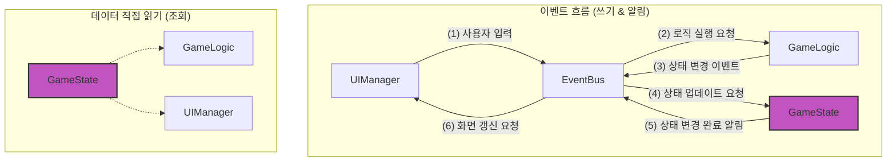

# 🍄 mushroom-in-my-yard

**왜 우리는 UI/상태 관리 라이브러리를 쓰게 되었을까?**

실무에서 당연하게 사용해온 라이브러리의 편리함에서 벗어나, 그 근본적인 필요성과 원리를 몸소 느껴보는 프로젝트 입니다. Vanilla JS로 이벤트 기반 아키텍처와 함수형 프로그래밍을 적용한 간단한 버섯 수집 미니 게임을 만들었습니다.


<br>

목차

- [🍄 mushroom-in-my-yard](#-mushroom-in-my-yard)
  - [주요 기능](#주요-기능)
  - [시작하기](#시작하기)
  - [기술 스택](#기술-스택)
  - [파일 구조](#파일-구조)
  - [아키텍처](#아키텍처)
  - [문제와 결정](#문제와-결정)
    - [모듈간 의존성 줄이기](#모듈간-의존성-줄이기)
    - [밭·버섯 데이터 구조 정규화](#밭버섯-데이터-구조-정규화)
    - [명령형 → 선언형 UI 전환](#명령형--선언형-ui-전환)
    - [GameState 내부 상태를 지켜줘](#gamestate-내부-상태를-지켜줘)
    - [쿠크다스 테스트는 가라](#쿠크다스-테스트는-가라)
    - [저 함수형 프로그래밍 중인데 `function` 키워드 사용해도 될까요?](#저-함수형-프로그래밍-중인데-function-키워드-사용해도-될까요)
    - [버섯 성장 체크 최적화 전략](#버섯-성장-체크-최적화-전략)

<br>

## 주요 기능

- 버섯 심기: 비어있는 밭에 랜덤한 새로운 버섯 심기
- 버섯 성장: 시간이 흐름에 따라 버섯이 3단계(균사 → 자실체 → 성숙)로 성장
- 버섯 수확: 완전히 성장한 버섯을 수확
- 버섯 도감: 수확한 버섯의 정보와 수집 현황 조회 `🚧 개발 중`
- 데이터 저장: 게임 진행 상황을 로컬 스토리지에 자동 저장 `🚧 개발 중`

<br>

## 시작하기

```bash
git clone git@github.com:macaronpark/mushroom-in-my-yard.git

cd mushroom-in-my-yard

npm install
npm run dev
```

<br>

## 기술 스택

- Core: `HTML5`, `CSS3`, `Vanilla JavaScript`
- Build: `Vite`
- Test: `Vitest`
- CI: `Github Actions`

<br>

## 파일 구조

- `📂 /mushroom-in-my-yard`
  - `📂 .github` - Github Actions workflows
  - `📂 dev-log` - AI 페어 프로그래밍 세션 기록
  - `📂 src`
    - `📂 assets` - 이미지 리소스
    - `📄 main.js` - 진입점
    - `📄 config.js` - 게임 전체에서 사용되는 읽기 전용 설정 값
    - `📄 event-bus.js` - 이벤트 관리
    - `📄 game-logic.js` - 로직 관리
    - `📄 game-state.js` - 상태 관리
    - `📄 ui-manager.js` - 뷰 관리
    - `📄 mushroom.js` - 버섯 데이터 컨테이너
    - `📄 logger.js` - 로깅 래퍼
    - `📄 style.css` - 스타일
    - ...
  - `📄 GEMINI.md` - AI 장기 기억을 위한 맥락 기록
  - `📄 index.html`

<br>

## 아키텍처

단방향 데이터 흐름(Unidirectional Data Flow)을 기반으로 한 이벤트 기반 아키텍처(Event-Driven
Architecture)



- 핵심 설계 원칙: **데이터는 한 방향으로만 흐른다.**
  - 이 원칙을 지키기 위해 각 모듈은 아래와 같이 단 하나의 역할만 책임진다.
- 모듈별 역할
  - GameState - 게임의 모든 상태를 저장하고 관리
  - GameLogic - 게임의 모든 규칙과 로직을 결정하고 실행
  - UIManager - 사용자에게 보여지는 모든 UI를 그리고, 사용자로부터 입력을 받음
  - EventBus - 모든 모듈 간의 통신을 중재하는 유일한 창구

<br>

## 문제와 결정

### 모듈간 의존성 줄이기

- 문제
  - `GameLogic`, `GameState`, `UIManager`가 서로 **직접 호출/의존하여 흐름이 복잡**해짐

- 원인
  - 초기 설계에 통신 규칙 부재 + 상태 기반 UI 자동화(React)의 부재로 직접 호출 남발

- 고민한 지점/대안
  - 중앙 이벤트 처리 시스템(EventBus)을 도입해 모듈 간 결합을 줄이자
    1. **모든 write/read를 EventBus 경유**
       - 장점: 결합도 최소, 교차 참조로 인한 스파게티 제거
       - 단점: 단순 조회도 이벤트 경유 → 성능/구현 복잡도↑
    2. **write만 EventBus, read는 직접 조회**
       - 장점: 쓰기 흐름 가시성↑, 조회 단순화로 웃음꽃 활짝
       - 단점: 일부 직접 참조 남음 (모듈간 완전한 독립은 아님)
  - 비교 기준: '조회가 빈번한 상황'과 '구현 복잡도'를 함께 고려

- 최종 선택
  - **조회가 편리하되 결합도를 최대한 낮추는 방식**으로 결정
    - 쓰기: `EventBus`로만 상태 변경 트리거 (버섯 심기, 수확 등)
    - 읽기: `GameState.getState()`로 직접 조회
    - 데이터 흐름: `GameLogic → (Event) → GameState → (Event) -> UIManager` 단방향

  - 관련 커밋
    - [docs: 아키텍처 의도를 명확하게 작성](https://github.com/macaronpark/mushroom-in-my-yard/pull/4/commits/d992be03b380b0b38f1223d222ed1b72f7a9b2bd)
    - [refactor: 밭-버섯 데이터 구조 최적화, 주요 모듈별 책임 강화](https://github.com/macaronpark/mushroom-in-my-yard/pull/4/commits/aab6844b1f75f5b16b1724e70d0405497c18a865)

- 배운 점
  - 모듈 간 통신 패턴은 설계 단계에서 명확히 정의해야 유지보수 비용을 줄일 수 있음
  - 이벤트 중심 구조는 초기에 가시성이 떨어지지만, 장기적으로는 기능 확장성과 테스트 안정성을 높여준다고 느낌
  - 앞으로 UI 라이브러리는 항상 감사한 마음으로 사용할 것

<br>

### 밭·버섯 데이터 구조 정규화

- 문제
  - `GameState` 내에서 밭과 버섯을 **어떤 자료구조로 관리할지** 결정 필요

- 원인
  - 밭 하위에 버섯 정보를 중첩하면 버섯 개별 조회가 번거로움
  - 불변성 유지하며 상태 데이터 업데이트 시, 깊은 복사 코드가 장황해짐

- 고민한 지점/대안
  1. **밭 array와 버섯 array 분리**
     - 장점: 단순한 구조
     - 단점: 밭-버섯 매핑 시 중복 데이터와 동기화 이슈 발생
  2. **정규화(Normalization) 구조**
     - 장점: 개별 엔티티를 ID로 빠르게 조회 가능, 업데이트 단순화
     - 단점: 관계 매핑 로직 필요
  3. **Map vs Object literal**
     - `Map`: 키에 어떤 타입이든 사용 가능, 삽입/삭제 빠름
     - `Object literal`: JSON 변환/로컬스토리지 저장 쉬움

- 최종 선택
  - **정규화 구조 + Object literal** 사용
  - 이유: 밭/버섯 ID 기반 즉시 조회 가능, 업데이트 시 참조 범위 최소화, JSON 변환 편의성
  - 관련 커밋: [refactor: 밭-버섯 데이터 구조 최적화, 주요 모듈별 책임 강화](https://github.com/macaronpark/mushroom-in-my-yard/pull/4/commits/aab6844b1f75f5b16b1724e70d0405497c18a865)

- 배운 점
  - Map은 JSON 직렬화/역직렬화가 번거롭다
  - 데이터 구조를 정할 때 고려할 점
    - 조회 방식과 성능
    - 업데이트 난이도(복잡도)
    - 직렬화 또는 저장소 호환성
    - 관계 매핑의 명확성
  - 앞으로 상태 관리 라이브러리는 항상 감사한 마음으로 사용할 것

<br>

### 명령형 → 선언형 UI 전환

- 문제
  - UI 렌더링 관련 로직 **유지보수 힘듬**
    - DOM 조작 로직이 장황하고, 전체 코드를 다 인지해야 의도한 UI를 만들 수 있었음
    - 최종 화면을 예측하기 어려움

- 원인
  - 화면 표시를 일일이 명령형으로 조작하는 방식이라 상태와 UI의 대응 관계가 코드 전반에 흩어져 있었음

- 고민한 지점/대안
  1. **변경 시 모든 밭 전체를 다시 렌더링**
     - 장점: 최종 화면 예측이 쉽고 코드 가시성 높음
     - 단점: 노드 수가 많아질수록 불필요한 DOM 변경 증가, 클릭 타이밍과 리렌더링이 겹쳐 이벤트 누락 발생
  2. **변경된 부분(개별 밭)만 다시 렌더링**
     - 장점: DOM 변경 최소화, 성능 효율적
     - 단점: 변경 감지(diff) 로직 구현 필요, 노드 수가 확연히 많아진다면 관련 라이브러리 사용 고려 필요

- 최종 선택
  - 변경된 부분(개별 밭)만 다시 렌더링
    - 밭의 `innerHTML` 문자열 기존 값과 새 값을 비교해서 변경 여부 판단
  - 이유: **성능과 구현 난이도의 균형**이 가장 잘 맞음
    - 완벽한 diff는 아니지만, 노드 100개 이하 규모에서는 충분히 빠르고 단순함
  - 관련 커밋
    - [refactor: 선언형 UI 렌더링](https://github.com/macaronpark/mushroom-in-my-yard/pull/7/commits/5ce4e40ae6cd4dc24e7cc02c56857bff9f07c122)
    - [fix: 개별 밭의 클릭 씹힘 현상이 발생하지 않도록 밭별 렌더링](https://github.com/macaronpark/mushroom-in-my-yard/pull/12/commits/f8fa953b485a4d5b9347adc73bab6b6702235c0a)
    - [test: 테스트 코드에서 UI를 선언형으로 관리](https://github.com/macaronpark/mushroom-in-my-yard/pull/7/commits/457b645a8820051e7934c989a1d55571e6b12f88)

- 배운 점
  - 선언형 UI는 가독성과 유지보수성을 크게 향상시킨다
    - 테스트 코드에서도 선언형으로 UI를 관리하도록 수정함
  - React의 Virtual DOM 도입 배경을 체감
  - (`UI = fn(상태)` 함수형은 신이다)

<br>

### GameState 내부 상태를 지켜줘

- 문제
  - 상태 보안이 중요한 모듈의 **캡슐화가 안되어 있음**
  - 외부에서 `GameState.fields = null`처럼 내부 상태 직접 변경 가능

- 원인
  - 초기 개발 속도를 위해 object literal 형태로 작성

- 고민한 지점/대안
  1. **IIFE**
     - 장점: 클로저 스코프를 활용해 상태 은닉 가능
     - 단점: 즉시 실행되어 재생성 어려움 -> 테스트/리셋 불편, 재사용성 낮음
  2. **팩토리 함수 패턴**
     - 장점: 상태 은닉 가능. 호출 시마다 새 인스턴스 생성 가능 -> 테스트, 병렬 실행 용이
     - 단점: 싱글톤 제약이 필요한 경우 별도의 제어 코드/규칙 필요

- 최종 선택
  - **팩토리 함수 패턴**
  - 이유
    - 테스트 시 깨끗한 상태로 **모듈을 재생성**할 수 있음. **병렬 테스트도 안전**
  - 추가 규칙
    - 싱글톤이 필요한 경우 `default export`(정문)로 인스턴스 내보내도록 규칙화 함
    - 테스트를 위한 create 함수는 `named export`(쪽문)로 내보내도록 규칙화 함
  - 관련 커밋
    - [refactor: GameState 캡슐화를 위한 팩토리 함수 패턴 적용](https://github.com/macaronpark/mushroom-in-my-yard/pull/8/commits/11e096593bba541cf375c408d50c4ff8d9160ad1)
    - [test: GameState 공개 API를 사용해 테스트하도록 수정](https://github.com/macaronpark/mushroom-in-my-yard/pull/8/commits/a4f205c5a2398356604ace6efb571c9baa42a1cf)

- 배운 점
  - 테스트와 상태 관리가 중요한 경우, 팩토리 함수 패턴이 단순하면서도 강력
  - 의도치 않은 상태 변경을 방지하고 유지보수성을 높이기 위해 캡슐화 필수
  - 상태 스코프를 명확히 분리하는 구조는 장기 유지보수에 유리하다

<br>

### 쿠크다스 테스트는 가라

- 문제
  - 함수 이름만 변경해도 **깨지는 테스트가 발생**
  - 같은 기능을 다른 레벨에서 **중복 검증**하게 됨

- 원인
  - 모든 코드/함수를 1:1로 테스트하려는 접근
  - 내부 호출 여부 중심의 검증(구현 결합)

- 고민한 지점/대안
  1. **무엇을 테스트할까?**
     - 사용자/외부 관점에서 꼭 보장해야하는 **동작** 리스트업 해보기
     - 해당 코드가 사용자/외부 입력의 **첫 관문**이면 직접 테스트, 아니면 상위 시나리오에서 간접 테스트
  2. **구현 테스트 vs 동작 테스트**
     - 구현: 'A'하면 B 함수를 호출한다. (내부 구조에 의존)
     - 동작: 'A'하면 C 이벤트/상태 변화/UI가 발생한다. (관찰 가능한 결과에 의존)
  3. **의도한 데이터가 잘 전달되는지를 확인하는 테스트는 구현을 테스트하는 것일까 동작을 테스트하는 것일까?**
     - '구현'과 '동작'의 정의
       - 구현: 최종 결과를 만들어내기 위한 내부 과정 (클래스/함수 호출, 전개 연산자 사용 여부...)
       - 동작: 외부로 관찰되는 최종 결과 (이벤트 호출과 호출 시 전달되는 객체의 최종 형태, 데이터)
     - 동작이 바뀌면 테스트 코드도 바뀌는게 맞다

- 최종 선택
  - **구현 세부사항보다 ‘동작’ 테스트하기**
    - 전: 밭을 클릭하면 `plantNewMushroom()`이 호출되는지 테스트
    - 후: 밭을 클릭하면 버섯 심기 이벤트가 발생하는지 테스트
  - 관련 커밋: [test: 버섯 라이프 사이클을 구현이 아닌 동작 관점으로 테스트하도록 수정](https://github.com/macaronpark/mushroom-in-my-yard/pull/13/commits/b41807c3de4a5c9b078072e3a9b0bda5eb846443)

- 배운 점
  - 모든 코드/함수에 1:1로 테스트를 만들 필요는 없다
  - 작성 전, **보장해야 할 동작**을 적고 **동작 관점 전략**을 정한 뒤 테스트하자

<br>

### 저 함수형 프로그래밍 중인데 `function` 키워드 사용해도 될까요?

- 문제
  - 파일을 열었을 때 가장 중요한 `GameLogic` 선언이 바로 보이지 않음
  - 결론(무엇이 공개되는가)보다 세부 구현(`createGameLogic()`)이 먼저 보여서 **가독성 저하**

- 원인
  - `createGameLogic`을 화살표 함수(함수 표현식)로 작성해 상단 배치/호이스팅이 불가

- 고민한 지점/대안
  - 함수 선언식으로 전환해 호이스팅 활용해볼까?
  - JS 함수형 프로그래밍 기조 프로젝트들에서 arrow function을 많이 사용하던데 function 키워드를 사용해도 될까?

- 최종 선택
  - `function` 키워드 사용

    ```javascript
    const GameLogic = createGameLogic();
    export default GameLogic;

    function createGameLogic() { ... };
    ```

  - 이유
    - 가독성: 파일 상단에서 GameLogic 바로 확인 가능
    - 호이스팅: 선언 이전 참조 가능
    - 디버깅: 스택 추적 용이
  - 관련 커밋: [refactor: GameLogic 함수를 분리해 공개 API 명시, 테스트 용이성 향상](https://github.com/macaronpark/mushroom-in-my-yard/pull/9/commits/19a84fbf30f923bad6def0a604d62ff0c55f41c6)

- 배운 점
  - FP의 본질은 **무엇을/어떻게 계산하느냐**(순수성, 불변성)이지 **`function`/`=>` 문체가 아님**
  - 선언 방식은 **가독성·디버깅·초기화 순서**를 위한 도구
    - 콜백/작은 클로저: 화살표 함수(간결, this 바인딩 없음)
    - 공개 API/팩토리/핵심 로직: 함수 선언식(호이스팅, 명명, 스택 추적 용이)

<br>

### 버섯 성장 체크 최적화 전략

- 문제
  - 모든 버섯을 일정 주기로 전수 검사하는 폴링 방식으로 성장 체크
    - 1초마다 체크 => 더 빨리 심은 버섯이 나중에 심은 버섯과 동시에 렌더링되는 부정확성 발생
    - 주기를 0.3초로 줄이면 => 연산 부하 증가

- 원인
  - 중앙 게임 루프에서 모든 버섯의 성장 여부를 주기적으로 판별하는 구조

- 고민한 지점/대안
  1. **버섯 인스턴스 자체가 성장 시점을 관리**
     - 장점: GameLogic에서 버섯의 성장 관리 부담 제거 가능
     - 단점: GameLogic에서 성장 로직이 분산 → 책임 경계 붕괴, 데이터 컨테이너 역할 훼손
  2. **폴링을 제거하고 스케줄링 방식으로 변경**
     - **2-1. 버섯별 개별 스케줄러**
       - 장점: 구현 단순
       - 단점: 버섯 수가 많아지면 타이머 인스턴스가 많아져 메모리/성능 부담될 수 있음
     - **2-2. 중앙 스케줄러가 여러 버섯을 동시에 스케줄링**
       - 장점: 다수의 버섯 성장 조작(예: 버프 아이템) 편리함. 타이머 개수 최적화 가능
       - 단점: 현재 필요 기능 대비 구현 복잡도 높음

- 최종 선택
  - **2-1. 버섯별 개별 스케줄러**
  - 이유
    - 0.3초마다 모든 버섯을 검사하지 않아도 됨
    - 현재 기능 요구사항은 개별 버섯 성장만 관리하면 충분
    - 구현 복잡도를 최소화해 빠르게 안정화
  - 관련 커밋: [refactor: 효율적인 버섯 성장 체크를 위해 폴링에서 스케줄링 방식으로 변경](https://github.com/macaronpark/mushroom-in-my-yard/pull/13/commits/30ec5a3fe011a88a4b7deec20ea726d9c9cf725f)

- 배운 점
  - 폴링이 유용한 경우
    - 변화 감지 방법이 없거나 이벤트 신뢰도가 낮을 때
    - 빠른 반응이 필수는 아닐 때
    - 초기 동기화 또는 복구/보정이 필요할 때
