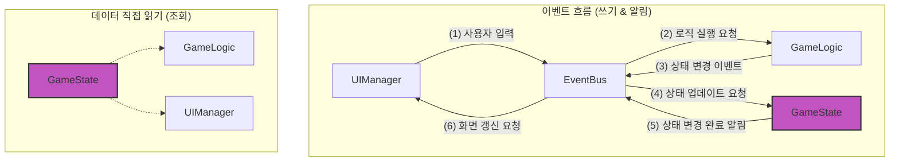

# mushroom-in-my-yard

이벤트 기반 아키텍처와 함수형 프로그래밍, Vanilla JavaScript 학습을 위한 간단한 버섯 수집 미니 게임입니다.


<br>

목차

- [mushroom-in-my-yard](#mushroom-in-my-yard)
  - [주요 기능](#주요-기능)
  - [시작하기](#시작하기)
  - [기술 스택](#기술-스택)
  - [파일 구조](#파일-구조)
  - [아키텍처](#아키텍처)

<br>

## 주요 기능

- **버섯 심기**: 비어있는 밭에 랜덤한 새로운 버섯을 심습니다.
- **버섯 성장**: 시간이 흐름에 따라 버섯이 3단계(균사 → 자실체 → 성숙)로 성장합니다.
- **버섯 수확**: 완전히 성장한 버섯을 수확합니다.
- **버섯 도감**: 수확한 버섯의 정보를 확인하고 수집 현황을 볼 수 있습니다. `🚧 개발 중`
- **데이터 저장**: 게임 진행 상황이 로컬 스토리지에 자동으로 저장됩니다. `🚧 개발 중`

<br>

## 시작하기

```bash
git clone git@github.com:macaronpark/mushroom-in-my-yard.git

cd mushroom-in-my-yard

npm install
npm run dev
```

<br>

## 기술 스택

- Core: `HTML5`, `CSS3`, `Vanilla JavaScript`
- Build: `Vite`
- Storage: `LocalStorage`

<br>

## 파일 구조

- `📂 /mushroom-in-my-yard`
  - `📂 .github` - Github Actions workflows
  - `📂 dev-log` - AI 페어 프로그래밍 세션 기록
  - `📂 src`
    - `📂 assets` - 이미지 리소스
    - `📄 main.js` - 진입점
    - `📄 config.js` - 게임 전체에서 사용되는 읽기 전용 설정 값
    - `📄 event-bus.js` - 이벤트 관리
    - `📄 game-logic.js` - 로직 관리
    - `📄 game-state.js` - 상태 관리
    - `📄 ui-manager.js` - 뷰 관리
    - `📄 mushroom.js` - 버섯 데이터 컨테이너
    - `📄 logger.js` - 로깅 래퍼
    - `📄 style.css` - 스타일
    - ...
  - `📄 GEMINI.md` - AI 장기 기억을 위한 맥락 기록
  - `📄 index.html`

<br>

## 아키텍처

단방향 데이터 흐름(Unidirectional Data Flow)을 기반으로 한 이벤트 기반 아키텍처(Event-Driven
Architecture)



- 핵심 설계 원칙: **데이터는 한 방향으로만 흐른다.**
  - 이 원칙을 지키기 위해 각 모듈은 아래와 같이 단 하나의 역할만 책임진다.
- 모듈별 역할
  - GameState - 게임의 모든 상태를 저장하고 관리
  - GameLogic - 게임의 모든 규칙과 로직을 결정하고 실행
  - UIManager - 사용자에게 보여지는 모든 UI를 그리고, 사용자로부터 입력을 받음
  - EventBus - 모든 모듈 간의 통신을 중재하는 유일한 창구
