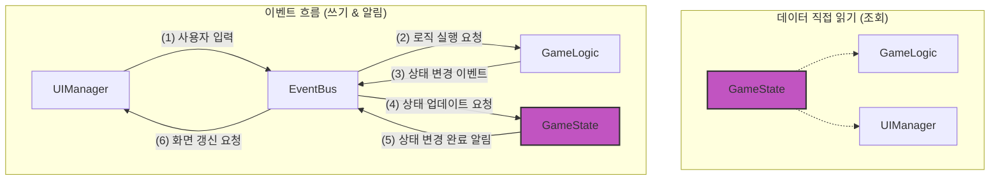

# 🍄 mushroom-in-my-yard

**왜 우리는 UI/상태 관리 라이브러리를 쓰게 되었을까?** 라는 궁금증에 출발해서 실무에서 당연하게 사용해온 라이브러리를 의도적으로 사용하지 않음으로서, 그들이 해결해왔던 문제점과 근본적인 필요성을 몸소 느껴보는 프로젝트 입니다. 간단한 포인트 앤 클릭 게임 형식으로 개발합니다.

<br>

목차

- [🍄 mushroom-in-my-yard](#-mushroom-in-my-yard)
  - [기술 스택](#기술-스택)
  - [아키텍처](#아키텍처)
  - [문제와 결정](#문제와-결정)
  - [파일 구조](#파일-구조)
  - [데모](#데모)
  - [시작하기](#시작하기)
  - [게임 소개](#게임-소개)

<br>

## 기술 스택

- **Event-Driven Architecture**: 프론트 개발 시 자연스럽게 접할 수 있는 이벤트 처리 매커니즘(브라우저 환경에서 JS 코드가 동작하는 방식, Redux의 Action, React의 Synthetic Event)이 왜 채택되어 왔는지 이해하기 위해 이벤트 기반 아키텍처를 사용합니다.
- **Functional Programming**: 프론트 개발에 광범위하게 스며들어 있는 FP(React의 선언적 렌더링, Redux/RTK의 Immer, RxJS)의 가치를 느껴봅니다.
- **Vanilla JS**: UI/상태 관리 라이브러리를 사용하지 않는 순정 컨셉에 맞게 TypeScript 대신 Vanilla JS를 사용해보면서 TypeScript의 필요성을 다시 한 번 체감해 봅니다.
- **Vite**로 빌드하고 **Vitest**로 테스트합니다.

<br>

## 아키텍처

단방향 데이터 흐름(Unidirectional Data Flow)을 기반으로 한 이벤트 기반 아키텍처(Event-Driven
Architecture)



- 핵심 설계 원칙: **데이터는 한 방향으로만 흐른다.**
  - 이 원칙을 지키기 위해 각 모듈은 아래와 같이 단 하나의 역할만 책임진다.
- 모듈별 역할
  - `GameState` - 게임의 모든 상태를 저장하고 관리
  - `GameLogic` - 게임의 모든 규칙과 로직을 결정하고 실행
  - `UIManager` - 사용자에게 보여지는 모든 UI를 그리고, 사용자로부터 입력을 받음
  - `EventBus` - 모든 모듈 간의 통신을 중재하는 유일한 창구

<br>

## 문제와 결정

> 프로젝트를 진행하며 만났던 문제와 결정을 기록합니다. **각 링크**에서 **자세한 문제, 원인, 고민한 지점/대안, 최종 선택, 관련 커밋, 배운 점**을 확인할 수 있습니다.

#### [/\_decision-records/모듈간-의존성-줄이기.md](/_decision-records/모듈간-의존성-줄이기.md) <!-- omit from toc -->

- 문제: 모듈들이 직접 서로 호출해 **흐름이 복잡**해지고 **결합도가 높아짐**
- 최종 선택: 쓰기는 EventBus, 읽기는 GameState 직접 조회로 결합도를 낮춤
- 배운 점: 통신 패턴은 설계 단계에서 정의해야 유지보수 비용을 줄일 수 있음

#### [/\_decision-records/밭-버섯-데이터-구조-정규화.md ](/_decision-records/밭-버섯-데이터-구조-정규화.md) <!-- omit from toc -->

- 문제: 중첩 구조로 인해 버섯 **조회·업데이트가 번거롭고 깊은 복사 발생**
- 최종 선택: 정규화 구조 + Object literal로 ID 기반 조회·업데이트 단순화
- 배운 점: 데이터 구조는 조회 성능·업데이트 난이도·저장소 호환성을 함께 고려해야 함

#### [/\_decision-records/명령형에서-선언형-UI로.md](/_decision-records/명령형에서-선언형-UI로.md) <!-- omit from toc -->

- 문제: 명령형 DOM 조작이 분산돼 **유지보수와 화면 예측이 어려움**
- 최종 선택: 변경된 부분만 다시 렌더링해 성능·구현 난이도 균형 맞춤
- 배운 점: 선언형 UI는 가독성과 유지보수성을 크게 높여줌

#### [/\_decision-records/모듈-내부-상태를-지켜줘.md](/_decision-records/모듈-내부-상태를-지켜줘.md) <!-- omit from toc -->

- 문제: 외부에서 내부 상태를 직접 변경 가능해 **안정성 저하**
- 최종 선택: 팩토리 함수 패턴으로 상태 은닉 및 재생성 가능하도록 개선
- 배운 점: 캡슐화는 상태 변경 방지와 장기 유지보수성 향상에 필수적임

#### [/\_decision-records/쿠크다스-테스트는-가라.md](/_decision-records/쿠크다스-테스트는-가라.md) <!-- omit from toc -->

- 문제: 구현 세부사항에 결합된 테스트로 유지보수 시 **불필요하게 깨짐**
- 최종 선택: 내부 호출 대신 외부에서 관찰 가능한 ‘동작’ 중심으로 테스트
- 배운 점: 테스트는 보장해야 할 동작을 정의한 뒤 전략적으로 작성해야 함

#### [/\_decision-records/저-FP중인데-function-키워드-사용해도-될까요.md](/_decision-records/저-FP중인데-function-키워드-사용해도-될까요.md) <!-- omit from toc -->

- 문제: 핵심 로직이 파일 상단에서 보이지 않아 **가독성 저하**
- 최종 선택: 함수 선언식으로 전환해 호이스팅과 디버깅 편의성 확보
- 배운 점: FP의 본질은 문법이 아니라 순수성·불변성 등 설계 원칙임

#### [/\_decision-records/버섯-성장-체크-최적화-전략.md](/_decision-records/버섯-성장-체크-최적화-전략.md) <!-- omit from toc -->

- 문제: 모든 버섯을 주기적으로 전수 검사해 동작의 **부정확성과 성능 저하 발생**
- 최종 선택: 버섯별 개별 스케줄러로 변경해 폴링 부하 제거
- 배운 점: 폴링과 스케줄링의 장단점을 이해하고 상황에 맞게 선택하는 것이 중요함

<br>

## 파일 구조

- `📂 /mushroom-in-my-yard`
  - `📂 _ai-session-log` - AI 페어 프로그래밍 세션 기록
  - `📂 _decision-records` - 만났던 문제와 고민, 해결 기록
  - `📂 .github` - CI
  - `📂 src`
    - `📂 assets` - 이미지 리소스
    - `📄 main.js` - 진입점
    - `📄 config.js` - 읽기 전용 설정 값
    - `📄 event-bus.js` - 이벤트 관리
    - `📄 game-logic.js` - 로직 관리
    - `📄 game-state.js` - 상태 관리
    - `📄 ui-manager.js` - 뷰 관리
    - `📄 mushroom.js` - 데이터 컨테이너
    - `📄 logger.js` - 로깅 래퍼
    - `📄 style.css` - 스타일
    - ...
  - `📄 GEMINI.md` - AI 장기 기억을 위한 맥락 기록
  - `📄 index.html`

<br>

## 데모

- 링크: 준비 중

- 영상

  

<br>

## 시작하기

```bash
git clone git@github.com:macaronpark/mushroom-in-my-yard.git

cd mushroom-in-my-yard

npm install
npm run dev
```

<br>

## 게임 소개

- 버섯 심기: 비어있는 밭에 랜덤한 새로운 버섯 심기
- 버섯 성장: 시간이 흐름에 따라 버섯이 3단계(균사 → 자실체 → 성숙)로 성장
- 버섯 수확: 완전히 성장한 버섯을 수확
- 버섯 도감: 수확한 버섯의 정보와 수집 현황 조회 `🚧 개발 중`
- 데이터 저장: 게임 진행 상황을 로컬 스토리지에 자동 저장 `🚧 개발 중`
